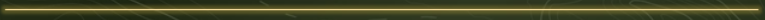

<!-- README.md is generated from README.Rmd. Please edit that file -->

```{r, include = FALSE}
knitr::opts_chunk$set(
  collapse = TRUE
  , echo = FALSE
  , comment = "#>"
  , fig.path = "README_files/README-"
  , out.width = "100%"
)
includeFigure = function(x) {
  knitr::include_graphics(file.path("README_files", x))
}
```

```{r}
includeFigure("RdistanceTopBanner.PNG")
```

<!-- badges: start -->
[](http://www.r-pkg.org/pkg/Rdistance)
[](http://cran.rstudio.com/web/packages/Rdistance/index.html)
[](https://travis-ci.org/tmcd82070/Rdistance)
[](http://www.r-pkg.org/pkg/Rdistance)
[](https://codecov.io/gh/tmcd82070/Rdistance)
<!-- badges: end -->

# Simplified Distance-Sampling Analysis in R

The **Rdistance** package contains routines for
  distance-sampling analyses. 
  Distance-sampling is a popular method for estimating density and 
  abundance of organisms in ecology. Abundance studies in ecology
  often count target organisms along sampling routes 
  (transects) or at a series of fixed observation stations.
  Typically, the chances of observing organisms 
  declines as distance from the observer increases. 
  Objects far away are typically harder to see than 
  objects nearby .  

  Distance-sampling studies are designed to correct for 
  this decline in 
  detection probabilities associated with distance. The key feature 
  of distance-sampling
  studies is that observers on transects or 
  at fixed points measure the distance between themselves and the objects 
  they count. Assuming all objects at the observer's 
  location are counted and that objects are randomly located in space, 
  distance-sampling analyses estimate the decline in 
  probability of detection as distance from the observer increases. 
  As detection probabilities decline, observers miss as many objects 
  as they observe and this "break even" distance is called 
  the *effective sampling distance*. 
  Unbiased estimates of density 
  divide the number of organisms seen by the effective 
  area sampled which is calculated using the effective sampling distance. 
  


```{r}
includeFigure("RdistanceSeparator.PNG")
```

## General Features of **`Rdistance`**   

**Rdistance** contains a set of
  functions to conduct 
  distance-sampling analyses from data collected on point or line transects. 
  The primary routines fit models (likelihood functions) to observed 
  distances. Other routines use the fitted likelihoods
  to estimate effective sampling distances and probability of detection. 
  From probability of detection, density and abundance in the study area 
  is estimated without observation bias. 
  
The likelihoods, or distance models, in **Rdistance** are 
  specified  using regression-like formula (similar 
  to `lm`, `glm`, etc.). Likelihoods can be functions of 
  detection or transect-level covariates. Abundance routines accept fitted likelihood
  objects and perform automated bootstrapping to estimate confidence intervals. 
  Overall (study area) and site-level (transect or point) 
  abundance estimates are available. A large suite of classical, 
  parametric detection functions are 
  included along with some uncommon parametric 
  functions (e.g., Gamma, negative exponential) and non-parametric
  smoothed distance functions. Custom (user-defined) detection functions
  are easily implemented (see vignette). 
  The help files and vignettes have been 
  vetted by multiple authors and tested in workshop 
  settings. Plot methods for distance function objects are included. 
  
  
**Rdistance Resources:** The best place to learn about `Rdistance` is at a workshop, 
processing a vignette, or the package's [GitHub Wiki](https://github.com/tmcd82070/Rdistance/wiki).

```{r}
includeFigure("RdistanceSeparator.PNG")
```
<!--  -->


## Installation

You can install the development version of Rdistance from [GitHub](https://github.com/) with:

**Stable version:** 
``` r
install.packages("Rdistance")
```

**Development version:** Directly from GitHub using the `devtools` package:

``` r
if( !require("devtools") ){
  install.packages("devtools")
}
devtools::install_github("tmcd82070/Rdistance")
```

```{r}
includeFigure("RdistanceSeparator.PNG")
```

## Examples 

These examples show the basic workflow of a distance-sampling analysis in 
`Rdistance`:

### Line Transects - No Covariates

```{r sparrowData, echo=TRUE}
library(Rdistance)

# Example data
data("sparrowDetectionData")
data("sparrowSiteData")
head(sparrowDetectionData)
head(sparrowSiteData)
```

```{r lineHazrateExample, echo=TRUE}
dfuncFit <- dfuncEstim(dist ~ 1
                   , detectionData = sparrowDetectionData
                   , likelihood = "hazrate")
dfuncFit <- abundEstim(dfuncFit
         , detectionData = sparrowDetectionData
         , siteData = sparrowSiteData
         , area = units::set_units(2500, "hectares"), ci=NULL)
print(dfuncFit)
plot(dfuncFit)
```


### Line Transects - With Vegetation Covariate

```{r lineHazrateExampleCovars, echo=TRUE}
dfuncFit <- dfuncEstim(dist ~ bare
                   , detectionData = sparrowDetectionData
                   , siteData = sparrowSiteData
                   , likelihood = "hazrate")
dfuncFit <- abundEstim(dfuncFit
         , detectionData = sparrowDetectionData
         , siteData = sparrowSiteData
         , area = units::set_units(2500, "hectares"), ci=NULL)
print(dfuncFit)
plot(dfuncFit, newdata = data.frame(bare = c(30, 40, 50)), lty = 1)
```

### Point Transects - No Covariates

```{r thrasherData, echo=TRUE}
# Example data
data("thrasherDetectionData")
data("thrasherSiteData")
head(thrasherDetectionData)
head(thrasherSiteData)
```

```{r pointHazrateExample, echo=TRUE}
dfuncFit <- dfuncEstim(dist ~ 1
                   , detectionData = thrasherDetectionData
                   , likelihood = "hazrate"
                   , pointSurvey = TRUE)
dfuncFit <- abundEstim(dfuncFit
         , detectionData = thrasherDetectionData
         , siteData = thrasherSiteData
         , area = units::set_units(100, "acres"), ci=NULL)
print(dfuncFit)
plot(dfuncFit)
```

### Point Transects - With Vegetation Covariates

```{r pointHazrateExampleCovars, echo=TRUE}
dfuncFit <- dfuncEstim(dist ~ bare + shrub
                   , detectionData = thrasherDetectionData
                   , siteData = thrasherSiteData
                   , likelihood = "hazrate"
                   , pointSurvey = TRUE)
dfuncFit <- abundEstim(dfuncFit
         , detectionData = thrasherDetectionData
         , siteData = thrasherSiteData
         , area = units::set_units(100, "acres"), ci=NULL)
print(dfuncFit)
plot(dfuncFit, newdata = data.frame(bare = c(30, 35, 40)
                                  , shrub = 20)
     , lty = 1)
```

<!-- github CI examples for auto rendering of Rmd <https://github.com/r-lib/actions/tree/v1/examples>. -->

```{r}
includeFigure("RdistanceSeparator.PNG")
```


# RECENT CHANGES

**Version 2.2.0: Major Update** (Fall 2022)

New features:

* Measurement units on all distances are **required** 
* Allowed expansions and covariates in the same distance function
* Renamed "uniform" likelihood to "logistic". Uniform is deprecated.
* Added covariates to Gamma likelihood estimation
* Added color to printed output in RStudio
* Reformatted output of abundance results
* Updated starting values for faster estimation
* Bug fixes:
  * Fixed issue with contrasts in model.matrix
  * Fixed issue with no observations during bootstrapping
  * Fixed issues with changing scale locations (i.e., x.scl and g.x.sxl)
  * Fixed ESW for w.lo > 0
  * Restricted likelihood values to be positive
* Substantial documentation updates
* Substantial testing facilities added. 


**Version 2.1.3: Bug Fixes**

* Fixed scaling error in the Gamma likelihood causing mode to be less than 1.0
* Fixed inverted plots that occured when w.lo > 0 (left-trunctation)
* Fixed bug in `autoDistSamp` when `bySite=TRUE`
* Fixed bug causing bootstrap failure of point transect surveys 
when `siteData` contained only one column 


**Version 2.1.2: A Major Update**

New features included:

* Point transect analysis (v1.3.2 only allowed line transects)
* Covariates in the detection function (v1.3.2 did not allow covariates).  
* Non-parametric (smoothed) distance functions
* Enhanced plotting abilities
* Enhanced vignettes
* Many bug fixes

```{r}
includeFigure("RdistanceSeparator.PNG")
```


## Past Workshops

* *Distance Sampling: Conventional and Hierarchical Methods for Abundance in R*
    * Full-day workshop, 10/29/2017, The Society for Marine Mammalogy, Halifax, Nova Scotia
* *Distance Sampling: Conventional and Hierarchical Methods for Abundance in R*
    * Full-day workshop, 9/23/2017, The Wildlife Society, Albuquerque, NM
 
```{r}
includeFigure("RdistanceSeparator.PNG")
```

## Contact

Questions or interested in a future workshop? Contact the maintainer: Trent McDonald (trent@mcdonalddatasciences.com) 
