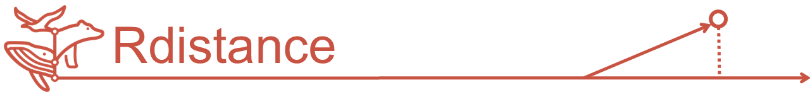
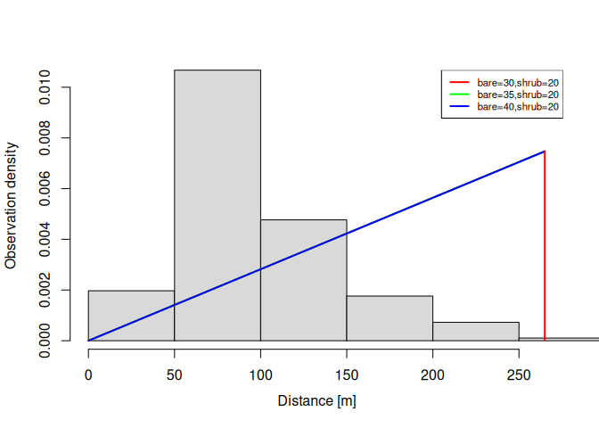

<!-- badges: start -->
<center>

[](http://www.r-pkg.org/pkg/Rdistance)
[](http://cran.rstudio.com/web/packages/Rdistance/index.html)
[](http://www.r-pkg.org/pkg/Rdistance)
[](https://codecov.io/gh/tmcd82070/Rdistance)
[](https://lifecycle.r-lib.org/articles/stages.html#stable)

[](https://github.com/tmcd82070/Rdistance/commits/master)


</center>
<!-- [](https://travis-ci.org/tmcd82070/Rdistance) -->
<!-- badges: end -->

## Simplified Distance-Sampling in R

**Rdistance** analyzes line- and point-transect distance-sampling data.
If you are unfamiliar with distance-sampling, check out our primer,
[Distance Sampling for the Average
Joe](https://github.com/tmcd82070/Rdistance/wiki/Distance-Sampling-for-the-Average-Joe).
If you are ready to take on an analysis, the best place to start is the
**Examples** section (below). The *Example* sections of help files
`?RdistDf`, `?dfuncEstim`, and `?abundEstim` contain enough information
to get you started and explain a few details of analysis in
**Rdistance**. The **Rdistance**
[wiki](https://github.com/tmcd82070/Rdistance/wiki) (always a
work-in-progress) contains additional information on distance sampling
and is the equivalent of vignettes.


## Features

- Line-transect and point-transects
- Likelihood functions:
  - half-normal (`halfnorm`)
  - hazard rate (`hazrate`)
  - negative exponential (`negexp`)
- Expansion terms
- Standard methods: `print`, `plot`, `predict`, `AIC`, etc.
- Observation and transect-level distance function covariates
- Standard R formula model specification (e.g.,
  `distance ~ elevation + observer`)
- Measurement unit control and automatic conversion
- Automated bootstrap confidence intervals
- Overall (study area) and site level abundance estimates
- Help and wiki content taught at multiple workshops and reviewed by
  multiple authors


## Current Release

## Installation

The current release is
[here](https://github.com/tmcd82070/Rdistance/releases). Install the
current release directly from CRAN:

``` r
install.packages("Rdistance")
```

**Rdistance** is under active development. Install the development
version from [GitHub](https://github.com/) using:

``` r
if( !require("devtools") ){
  install.packages("devtools")
}
devtools::install_github("tmcd82070/Rdistance")
```


## Examples

These examples show basic estimation of abundance via distance-sampling
analyses, both with and without covariates.

### Line Transects - No Covariates

``` r
library(Rdistance)
#> Loading required package: units
#> udunits database from /usr/share/xml/udunits/udunits2.xml
#> Rdistance (v4.0.3)

# Example data
data("sparrowDetectionData")  # access example data
data("sparrowSiteData")
head(sparrowDetectionData)  # inspect data
#>   siteID groupsize sightdist sightangle     dist
#> 1     A1         1        65         15 16.8 [m]
#> 2     A1         1        70         10 12.2 [m]
#> 3     A1         1        25         75 24.1 [m]
#> 4     A1         1        40          5  3.5 [m]
#> 5     A1         1        70         85 69.7 [m]
#> 6     A1         1        10         90 10.0 [m]
head(sparrowSiteData)
#>   siteID  length observer bare herb shrub height shrubclass
#> 1     A1 500 [m]     obs4 36.7 15.9  20.1   26.4       High
#> 2     A2 500 [m]     obs4 38.7 16.1  19.3   25.0       High
#> 3     A3 500 [m]     obs5 37.7 18.8  19.8   27.0       High
#> 4     A4 500 [m]     obs5 37.7 17.9  19.9   27.1       High
#> 5     B1 500 [m]     obs3 58.5 17.6   5.2   19.6        Low
#> 6     B2 500 [m]     obs3 56.6 18.1   5.2   19.0        Low

# Make nested data frame required by Rdistance
sparrowDf <- RdistDf(sparrowSiteData
                   , sparrowDetectionData
                   , by = "siteID"
                   , pointSurvey = FALSE
                   , observer = "single"
                   , .detectionCol = "detections"
                   , .effortCol = "length")
head(sparrowDf)
#> # A tibble: 6 × 9
#> # Rowwise:  siteID
#>   siteID         detections length observer  bare  herb shrub height shrubclass
#>   <fct>  <list<tibble[,4]>>    [m] <fct>    <dbl> <dbl> <dbl>  <dbl> <fct>     
#> 1 A1               [15 × 4]    500 obs4      36.7  15.9  20.1   26.4 High      
#> 2 A2               [13 × 4]    500 obs4      38.7  16.1  19.3   25   High      
#> 3 A3               [10 × 4]    500 obs5      37.7  18.8  19.8   27   High      
#> 4 A4               [14 × 4]    500 obs5      37.7  17.9  19.9   27.1 High      
#> 5 B1                [1 × 4]    500 obs3      58.5  17.6   5.2   19.6 Low       
#> 6 B3                [6 × 4]    500 obs1      56.8  18.4   7.5   19.7 Low
summary(sparrowDf, formula = dist ~ groupsize(groupsize))
#> Transect type: line
#> Effort:
#>        Transects: 72        
#>     Total length: 36000 [m] 
#> Distances:
#>    0 [m] to 207 [m]: 356
#> Sightings:
#>          Groups: 356 
#>     Individuals: 374
# see detections on transect A1
sparrowDf |> 
  dplyr::filter(siteID == "A1") |>
  dplyr::reframe(detections)
#> # A tibble: 15 × 5
#>    siteID groupsize sightdist sightangle dist
#>    <fct>      <int>     <int>      <int>  [m]
#>  1 A1             1        65         15 16.8
#>  2 A1             1        70         10 12.2
#>  3 A1             1        25         75 24.1
#>  4 A1             1        40          5  3.5
#>  5 A1             1        70         85 69.7
#>  6 A1             1        10         90 10  
#>  7 A1             1        15         85 14.9
#>  8 A1             1         5         20  1.7
#>  9 A1             1         4         90  4  
#> 10 A1             1        10         85 10  
#> 11 A1             1        10         80  9.8
#> 12 A1             1        70         75 67.6
#> 13 A1             1        75         80 73.9
#> 14 A1             1        75         85 74.7
#> 15 A1             1        30         45 21.2
# see detections on 5th transect
sparrowDf$detections[[5]]
#> # A tibble: 1 × 4
#>   groupsize sightdist sightangle dist
#>       <int>     <int>      <int>  [m]
#> 1         1        13         25  5.5
```

#### Estimate hazard rate distance function

``` r
# Set upper (right) truncation distance
whi <- set_units(200, "m")
# Fit hazard rate likelihood and estimate density per ha
oneHectare <- set_units(1, "ha")

# To save computation time, only compute point estimates.
# change `ci = NULL` to `ci = 0.95` to compute confidence intervals
dfuncFit <- sparrowDf |>
  dfuncEstim(dist ~ groupsize(groupsize)
           , likelihood = "hazrate"
           , w.hi = whi) |> 
  abundEstim(area = oneHectare
           , ci = NULL)
summary(dfuncFit)
#> Call: dfuncEstim(data = sparrowDf, dist ~ groupsize(groupsize),
#>    likelihood = "hazrate", w.hi = whi)
#> Coefficients:
#>              Estimate  SE         z          p(>|z|)     
#> (Intercept)  3.880324  0.1024185  37.886959  0.000000e+00
#> k            2.966557  0.3724577   7.964816  1.654703e-15
#> 
#> Convergence: Success
#> Function: HAZRATE  
#> Strip: 0 [m] to 200 [m] 
#> Effective strip width (ESW): 64.40993 [m] 
#> Probability of detection: 0.3220496
#> Scaling: g(0 [m]) = 1
#> Log likelihood: -1647.79 
#> AICc: 3299.614
#> 
#>      Surveyed Units: 36000 [m] 
#>    Individuals seen: 372 in 354 groups 
#>  Average group size: 1.050847 
#>    Group size range: 1 to 3 
#> Density in sampled area: 8.021538e-05 [1/m^2]
#> Abundance in 10000 [m^2] study area: 0.8021538
plot(dfuncFit, nbins = 30, border = NA)
```


``` r

# Estimate stored in output object
dfuncFit$estimates
#> # A tibble: 1 × 11
#> # Groups:   id [1]
#>   id     `(Intercept)`     k density abundance nGroups nSeen  area surveyedUnits
#>   <chr>          <dbl> <dbl> [1/m^2]     <dbl>   <int> <dbl> [m^2]           [m]
#> 1 Origi…          3.88  2.97 8.02e-5     0.802     354   372 10000         36000
#> # ℹ 2 more variables: avgGroupSize <dbl>, avgEffDistance [m]
```

### Line Transects - With Vegetation Covariate

``` r
# This time, estimates only. No confidence intervals
dfuncFit <- sparrowDf |>
  dfuncEstim(dist ~ bare + groupsize(groupsize)
           , likelihood = "hazrate"
           , w.hi = whi) |> 
  abundEstim(area = oneHectare
           , ci = NULL)

summary(dfuncFit)
#> Call: dfuncEstim(data = sparrowDf, dist ~ bare + groupsize(groupsize),
#>    likelihood = "hazrate", w.hi = whi)
#> Coefficients:
#>              Estimate   SE           z          p(>|z|)     
#> (Intercept)  3.2286705  0.230692317  13.995570  1.658934e-44
#> bare         0.0121463  0.003512757   3.457768  5.446697e-04
#> k            3.1555121  0.411057867   7.676564  1.634122e-14
#> 
#> Convergence: Success
#> Function: HAZRATE  
#> Strip: 0 [m] to 200 [m] 
#> Average effective strip width (ESW): 66.26353 [m] (range 48.15397 [m] to 86.61737 [m]) 
#> Average probability of detection: 0.3313176 (range 0.2407699 to 0.4330868)
#> Scaling: g(0 [m]) = 1
#> Log likelihood: -1641.974 
#> AICc: 3290.016
#> 
#>      Surveyed Units: 36000 [m] 
#>    Individuals seen: 372 in 354 groups 
#>  Average group size: 1.050847 
#>    Group size range: 1 to 3 
#> Density in sampled area: 8.02391e-05 [1/m^2]
#> Abundance in 10000 [m^2] study area: 0.802391
plot(dfuncFit
   , newdata = data.frame(bare = c(30, 40, 50))
   , lty = 1
   , nbins = 30
   , border = NA
   , col = "grey75")
```


### Point Transects - No Covariates

``` r
# Example data
data("thrasherDetectionData")  # access example data
data("thrasherSiteData")
head(thrasherDetectionData)  # inspect example data
#>   siteID groupsize    dist
#> 1  C1X01         1  11 [m]
#> 2  C1X01         1 183 [m]
#> 3  C1X02         1  58 [m]
#> 4  C1X04         1  89 [m]
#> 5  C1X05         1  83 [m]
#> 6  C1X06         1  95 [m]
head(thrasherSiteData)
#>   siteID observer bare herb shrub height npoints
#> 1  C1X01     obs5 45.8 19.5  18.7   23.7       1
#> 2  C1X02     obs5 43.4 20.2  20.0   23.6       1
#> 3  C1X03     obs5 44.1 18.8  19.4   23.7       1
#> 4  C1X04     obs5 38.3 22.5  23.5   34.3       1
#> 5  C1X05     obs5 41.5 20.5  20.6   26.8       1
#> 6  C1X06     obs5 43.7 18.6  20.0   23.8       1

# Make nested data frame required by Rdistance
thrasherDf <- RdistDf(thrasherSiteData
                   , thrasherDetectionData
                   , by = "siteID"
                   , pointSurvey = TRUE
                   , observer = "single"
                   , .detectionCol = "detections"
                   , .effortCol = "npoints")
head(thrasherDf)
#> # A tibble: 6 × 8
#> # Rowwise:  siteID
#>   siteID         detections observer  bare  herb shrub height npoints
#>   <fct>  <list<tibble[,2]>> <fct>    <dbl> <dbl> <dbl>  <dbl>   <dbl>
#> 1 C1X01             [2 × 2] obs5      45.8  19.5  18.7   23.7       1
#> 2 C1X02             [1 × 2] obs5      43.4  20.2  20     23.6       1
#> 3 C1X04             [1 × 2] obs5      38.3  22.5  23.5   34.3       1
#> 4 C1X05             [1 × 2] obs5      41.5  20.5  20.6   26.8       1
#> 5 C1X06             [1 × 2] obs5      43.7  18.6  20     23.8       1
#> 6 C1X08             [1 × 2] obs5      41.5  20.1  20.9   29.4       1
summary(thrasherDf, formula = dist ~ groupsize(groupsize))
#> Transect type: point
#> Effort:
#>        Transects: 120          
#>     Total length: 120 [points] 
#> Distances:
#>    0 [m] to 265 [m]: 193
#> Sightings:
#>          Groups: 193 
#>     Individuals: 196
```

``` r
dfuncFit <- thrasherDf |>
  dfuncEstim(dist ~ groupsize(groupsize)
           , likelihood = "hazrate") |> 
  abundEstim(area = oneHectare
           , ci = NULL)

summary(dfuncFit)
#> Call: dfuncEstim(data = thrasherDf, dist ~ groupsize(groupsize),
#>    likelihood = "hazrate")
#> Coefficients:
#>              Estimate  SE          z          p(>|z|)     
#> (Intercept)  5.026968  0.05810598  86.513778  0.000000e+00
#> k            6.203649  1.14700558   5.408561  6.353324e-08
#> 
#> Convergence: Success
#> Function: HAZRATE  
#> Strip: 0 [m] to 265 [m] 
#> Effective detection radius (EDR): 173.0842 [m] 
#> Probability of detection: 0.4266022
#> Scaling: g(0 [m]) = 1
#> Log likelihood: -1035.695 
#> AICc: 2075.453
#> 
#>      Surveyed Units: 120 
#>    Individuals seen: 196 in 193 groups 
#>  Average group size: 1.015544 
#>    Group size range: 1 to 2 
#> Density in sampled area: 1.735442e-05 [1/m^2]
#> Abundance in 10000 [m^2] study area: 0.1735442
plot(dfuncFit
   , nbins = 15)
```


### Point Transects - With Vegetation Covariates

``` r
dfuncFit <- thrasherDf |>
  dfuncEstim(dist ~ bare + shrub + groupsize(groupsize)
           , likelihood = "hazrate") |> 
  abundEstim(area = oneHectare
           , ci = NULL)
summary(dfuncFit)
#> Call: dfuncEstim(data = thrasherDf, dist ~ bare + shrub +
#>    groupsize(groupsize), likelihood = "hazrate")
#> Coefficients:
#>              Estimate   SE  z   p(>|z|)
#> (Intercept)  4.2534879  NA  NA  NA     
#> bare         0.8884159  NA  NA  NA     
#> shrub        0.4584574  NA  NA  NA     
#> k            1.0061209  NA  NA  NA     
#> 
#> Convergence: VARIANCE FAILURE (singular variance-covariance matrix)
#> Function: HAZRATE  
#> Strip: 0 [m] to 265 [m] 
#> Average effective detection radius (EDR): 265 [m] (range 265 [m] to 265 [m]) 
#> Average probability of detection: 1 (range 1 to 1)
#> Scaling: g(0 [m]) = 1
#> Log likelihood: -1076.888 
#> AICc: 2161.988
#> 
#>      Surveyed Units: 120 
#>    Individuals seen: 196 in 193 groups 
#>  Average group size: 1.015544 
#>    Group size range: 1 to 2 
#> Density in sampled area: 7.403434e-06 [1/m^2]
#> Abundance in 10000 [m^2] study area: 0.07403434
plot(dfuncFit
   , newdata = data.frame(bare = c(30, 35, 40)
                       , shrub = 20)
   , lty = 1)
```



<!-- github CI examples for auto rendering of Rmd <https://github.com/r-lib/actions/tree/v1/examples>. -->


# RECENT CHANGES

See our [NEWS](NEWS.md) file for changes across version numbers.
