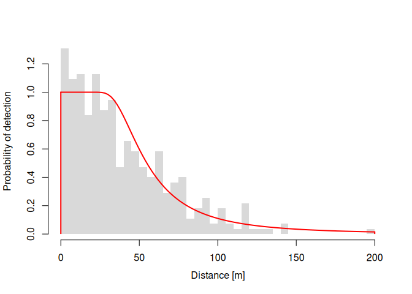

<!-- badges: start -->
<center>

[](http://www.r-pkg.org/pkg/Rdistance)
[](http://cran.rstudio.com/web/packages/Rdistance/index.html)
[](http://www.r-pkg.org/pkg/Rdistance)
[](https://codecov.io/gh/tmcd82070/Rdistance)
[](https://lifecycle.r-lib.org/articles/stages.html#stable)

[](https://github.com/tmcd82070/Rdistance/commits/master)


</center>
<!-- [](https://travis-ci.org/tmcd82070/Rdistance) -->
<!-- badges: end -->

# Simplified Distance-Sampling in R

**Rdistance** analyzes line- and point-transect distance-sampling data.
If you are unfamiliar with distance-sampling, check out our primer,
[Distance Sampling for the Average
Joe](https://github.com/tmcd82070/Rdistance/wiki/Distance-Sampling-for-the-Average-Joe).
For those ready to take on an analysis, the best place to start is one
of our vignettes or in the **Examples** section (below).

**Vignettes**:

- [Beginner Line
  Transects](https://cran.r-project.org/web/packages/Rdistance/vignettes/Rdistance_BeginnerLineTransect.pdf)
- [Extended Beginner Line Transects
  Examples](https://cran.r-project.org/web/packages/Rdistance/vignettes/Extended_dfuncEstim_Examples.pdf)


## Features

- Line-transect and point-transects
- Likelihood functions:
  - half-normal (`halfnorm`)
  - hazard rate (`hazrate`)
  - negative exponential (`negexp`)
  - Gamma (`Gamma`)
  - logistic (`logistic`)
- Non-parametric smoothed distance functions (`smu`)
- Built-in key functions: `sine`, `cosine`, and `hermite`
- Expansion terms
- Standard methods: `print`, `plot`, `predict`, `AIC`, etc.
- Observation and transect-level distance function covariates
- Standard R formula model specification (e.g.,
  `distance ~ elevation + observer`)
- Measurement unit control and automatic conversion
- Automated bootstrap confidence intervals
- Overall (study area) abundance estimates
- Custom (user-defined) detection functions
- Help and vignettes reviewed and edited by multiple authors


## Current Release

The current release is
[here](https://github.com/tmcd82070/Rdistance/releases).

## Installation

Install the development version from [GitHub](https://github.com/) with:

``` r
if( !require("devtools") ){
  install.packages("devtools")
}
devtools::install_github("tmcd82070/Rdistance")
```

Install the stable version directly from CRAN:

``` r
install.packages("Rdistance")
```


## Examples

Examples show the basic workflow of distance-sampling analysis in
`Rdistance` are on our [Examples wiki page](examples.md)

### Line Transects - No Covariates

``` r
if( !require("units") ){
  install.packages("units")
}
#> Loading required package: units
#> udunits database from C:/Users/trent/AppData/Local/R/win-library/4.2/units/share/udunits/udunits2.xml
library(Rdistance)
#> Rdistance (version 3.0.0)
library(units)

# Example data
data("sparrowDetectionData")  # access example data
data("sparrowSiteData")
head(sparrowDetectionData)  # inspect data
#>   siteID groupsize sightdist sightangle     dist
#> 1     A1         1        65         15 16.8 [m]
#> 2     A1         1        70         10 12.2 [m]
#> 3     A1         1        25         75 24.1 [m]
#> 4     A1         1        40          5  3.5 [m]
#> 5     A1         1        70         85 69.7 [m]
#> 6     A1         1        10         90 10.0 [m]
head(sparrowSiteData)
#>   siteID  length observer bare herb shrub height shrubclass
#> 1     A1 500 [m]     obs4 36.7 15.9  20.1   26.4       High
#> 2     A2 500 [m]     obs4 38.7 16.1  19.3   25.0       High
#> 3     A3 500 [m]     obs5 37.7 18.8  19.8   27.0       High
#> 4     A4 500 [m]     obs5 37.7 17.9  19.9   27.1       High
#> 5     B1 500 [m]     obs3 58.5 17.6   5.2   19.6        Low
#> 6     B2 500 [m]     obs3 56.6 18.1   5.2   19.0        Low
```

``` r
# Set upper (right) truncation distance
whi <- set_units(150, "m")
# Fit hazard rate likelihood
dfuncFit <- dfuncEstim(dist ~ 1
                   , detectionData = sparrowDetectionData
                   , likelihood = "hazrate"
                   , w.hi = whi)
dfuncFit <- abundEstim(dfuncFit
         , detectionData = sparrowDetectionData
         , siteData = sparrowSiteData
         , area = set_units(2500, "hectares"))
#> Computing bootstrap confidence interval on N...
#>   |                                                                              |                                                                      |   0%  |                                                                              |                                                                      |   1%  |                                                                              |=                                                                     |   1%  |                                                                              |=                                                                     |   2%  |                                                                              |==                                                                    |   2%  |                                                                              |==                                                                    |   3%  |                                                                              |===                                                                   |   4%  |                                                                              |===                                                                   |   5%  |                                                                              |====                                                                  |   5%  |                                                                              |====                                                                  |   6%  |                                                                              |=====                                                                 |   7%  |                                                                              |=====                                                                 |   8%  |                                                                              |======                                                                |   8%  |                                                                              |======                                                                |   9%  |                                                                              |=======                                                               |   9%  |                                                                              |=======                                                               |  10%  |                                                                              |=======                                                               |  11%  |                                                                              |========                                                              |  11%  |                                                                              |========                                                              |  12%  |                                                                              |=========                                                             |  12%  |                                                                              |=========                                                             |  13%  |                                                                              |==========                                                            |  14%  |                                                                              |==========                                                            |  15%  |                                                                              |===========                                                           |  15%  |                                                                              |===========                                                           |  16%  |                                                                              |============                                                          |  16%  |                                                                              |============                                                          |  17%  |                                                                              |============                                                          |  18%  |                                                                              |=============                                                         |  18%  |                                                                              |=============                                                         |  19%  |                                                                              |==============                                                        |  19%  |                                                                              |==============                                                        |  20%  |                                                                              |==============                                                        |  21%  |                                                                              |===============                                                       |  21%  |                                                                              |===============                                                       |  22%  |                                                                              |================                                                      |  22%  |                                                                              |================                                                      |  23%  |                                                                              |=================                                                     |  24%  |                                                                              |=================                                                     |  25%  |                                                                              |==================                                                    |  25%  |                                                                              |==================                                                    |  26%  |                                                                              |===================                                                   |  26%  |                                                                              |===================                                                   |  27%  |                                                                              |===================                                                   |  28%  |                                                                              |====================                                                  |  28%  |                                                                              |====================                                                  |  29%  |                                                                              |=====================                                                 |  29%  |                                                                              |=====================                                                 |  30%  |                                                                              |=====================                                                 |  31%  |                                                                              |======================                                                |  31%  |                                                                              |======================                                                |  32%  |                                                                              |=======================                                               |  32%  |                                                                              |=======================                                               |  33%  |                                                                              |========================                                              |  34%  |                                                                              |========================                                              |  35%  |                                                                              |=========================                                             |  35%  |                                                                              |=========================                                             |  36%  |                                                                              |==========================                                            |  36%  |                                                                              |==========================                                            |  37%  |                                                                              |==========================                                            |  38%  |                                                                              |===========================                                           |  38%  |                                                                              |===========================                                           |  39%  |                                                                              |============================                                          |  39%  |                                                                              |============================                                          |  40%  |                                                                              |============================                                          |  41%  |                                                                              |=============================                                         |  41%  |                                                                              |=============================                                         |  42%  |                                                                              |==============================                                        |  42%  |                                                                              |==============================                                        |  43%  |                                                                              |===============================                                       |  44%  |                                                                              |===============================                                       |  45%  |                                                                              |================================                                      |  45%  |                                                                              |================================                                      |  46%  |                                                                              |=================================                                     |  46%  |                                                                              |=================================                                     |  47%  |                                                                              |=================================                                     |  48%  |                                                                              |==================================                                    |  48%  |                                                                              |==================================                                    |  49%  |                                                                              |===================================                                   |  49%  |                                                                              |===================================                                   |  50%  |                                                                              |===================================                                   |  51%  |                                                                              |====================================                                  |  51%  |                                                                              |====================================                                  |  52%  |                                                                              |=====================================                                 |  52%  |                                                                              |=====================================                                 |  53%  |                                                                              |=====================================                                 |  54%  |                                                                              |======================================                                |  54%  |                                                                              |======================================                                |  55%  |                                                                              |=======================================                               |  55%  |                                                                              |=======================================                               |  56%  |                                                                              |========================================                              |  57%  |                                                                              |========================================                              |  58%  |                                                                              |=========================================                             |  58%  |                                                                              |=========================================                             |  59%  |                                                                              |==========================================                            |  59%  |                                                                              |==========================================                            |  60%  |                                                                              |==========================================                            |  61%  |                                                                              |===========================================                           |  61%  |                                                                              |===========================================                           |  62%  |                                                                              |============================================                          |  62%  |                                                                              |============================================                          |  63%  |                                                                              |============================================                          |  64%  |                                                                              |=============================================                         |  64%  |                                                                              |=============================================                         |  65%  |                                                                              |==============================================                        |  65%  |                                                                              |==============================================                        |  66%  |                                                                              |===============================================                       |  67%  |                                                                              |===============================================                       |  68%  |                                                                              |================================================                      |  68%  |                                                                              |================================================                      |  69%  |                                                                              |=================================================                     |  69%  |                                                                              |=================================================                     |  70%  |                                                                              |=================================================                     |  71%  |                                                                              |==================================================                    |  71%  |                                                                              |==================================================                    |  72%  |                                                                              |===================================================                   |  72%  |                                                                              |===================================================                   |  73%  |                                                                              |===================================================                   |  74%  |                                                                              |====================================================                  |  74%  |                                                                              |====================================================                  |  75%  |                                                                              |=====================================================                 |  75%  |                                                                              |=====================================================                 |  76%  |                                                                              |======================================================                |  77%  |                                                                              |======================================================                |  78%  |                                                                              |=======================================================               |  78%  |                                                                              |=======================================================               |  79%  |                                                                              |========================================================              |  79%  |                                                                              |========================================================              |  80%  |                                                                              |========================================================              |  81%  |                                                                              |=========================================================             |  81%  |                                                                              |=========================================================             |  82%  |                                                                              |==========================================================            |  82%  |                                                                              |==========================================================            |  83%  |                                                                              |==========================================================            |  84%  |                                                                              |===========================================================           |  84%  |                                                                              |===========================================================           |  85%  |                                                                              |============================================================          |  85%  |                                                                              |============================================================          |  86%  |                                                                              |=============================================================         |  87%  |                                                                              |=============================================================         |  88%  |                                                                              |==============================================================        |  88%  |                                                                              |==============================================================        |  89%  |                                                                              |===============================================================       |  89%  |                                                                              |===============================================================       |  90%  |                                                                              |===============================================================       |  91%  |                                                                              |================================================================      |  91%  |                                                                              |================================================================      |  92%  |                                                                              |=================================================================     |  92%  |                                                                              |=================================================================     |  93%  |                                                                              |==================================================================    |  94%  |                                                                              |==================================================================    |  95%  |                                                                              |===================================================================   |  95%  |                                                                              |===================================================================   |  96%  |                                                                              |====================================================================  |  97%  |                                                                              |====================================================================  |  98%  |                                                                              |===================================================================== |  98%  |                                                                              |===================================================================== |  99%  |                                                                              |======================================================================|  99%  |                                                                              |======================================================================| 100%
print(dfuncFit)
#> Call: dfuncEstim(formula = dist ~ 1, detectionData =
#>    sparrowDetectionData, likelihood = "hazrate", w.hi = whi)
#> Coefficients:
#>        Estimate   SE         z         p(>|z|)     
#> Sigma  43.584314  4.7041265  9.265124  1.948512e-20
#> k       2.405927  0.3096911  7.768797  7.923512e-15
#> 
#> Convergence: Success
#> Function: HAZRATE  
#> Strip: 0 [m] to 150 [m] 
#> Effective strip width (ESW): 61.11514 [m] 
#>                      95% CI: 49.53595 [m] to 75.55914 [m]
#> Probability of detection: 0.4074342 
#> Scaling: g(0 [m]) = 1
#> Negative log likelihood: 1631.795 
#> AICc: 3267.625
#> 
#>      Surveyed Units: 36000 [m] 
#>    Individuals seen: 353 in 353 groups 
#>  Average group size: 1 
#>               Range: 1 to 1 
#> 
#> Density in sampled area: 8.022199e-05 [1/m^2]
#>                  95% CI: 5.786421e-05 [1/m^2] to 0.0001081076 [1/m^2]
#> 
#> Abundance in 2.5e+07 [m^2] study area: 2005.55
#>                                95% CI: 1446.605 to 2702.691
plot(dfuncFit)
```



### Line Transects - With Vegetation Covariate

``` r
dfuncFit <- dfuncEstim(dist ~ bare
                   , detectionData = sparrowDetectionData
                   , siteData = sparrowSiteData
                   , likelihood = "hazrate"
                   , w.hi = whi)
dfuncFit <- abundEstim(dfuncFit
         , detectionData = sparrowDetectionData
         , siteData = sparrowSiteData
         , area = set_units(2500, "hectares")
         , ci=NULL)
print(dfuncFit)
#> Call: dfuncEstim(formula = dist ~ bare, detectionData =
#>    sparrowDetectionData, siteData = sparrowSiteData, likelihood =
#>    "hazrate", w.hi = whi)
#> Coefficients:
#>              Estimate    SE          z          p(>|z|)     
#> (Intercept)  3.06257745  0.27481293  11.144226  7.640549e-29
#> bare         0.01324778  0.00423315   3.129532  1.750852e-03
#> k            2.54796690  0.34648791   7.353696  1.927993e-13
#> 
#> Convergence: Success
#> Function: HAZRATE  
#> Strip: 0 [m] to 150 [m] 
#> Average effective strip width (ESW): 62.78704 [m] 
#> Average probability of detection: 0.4185803 
#> Scaling: g(0 [m]) = 1
#> Negative log likelihood: 1626.919 
#> AICc: 3259.908
#> 
#>      Surveyed Units: 36000 [m] 
#>    Individuals seen: 353 in 353 groups 
#>  Average group size: 1 
#>               Range: 1 to 1 
#> Density in sampled area: 8.023675e-05 [1/m^2]
#> Abundance in 2.5e+07 [m^2] study area: 2005.919
plot(dfuncFit, newdata = data.frame(bare = c(30, 40, 50)), lty = 1)
```


### Point Transects - No Covariates

``` r
# Example data
data("thrasherDetectionData")  # access example data
data("thrasherSiteData")
head(thrasherDetectionData)  # inspect example data
#>   siteID groupsize    dist
#> 1  C1X01         1  11 [m]
#> 2  C1X01         1 183 [m]
#> 3  C1X02         1  58 [m]
#> 4  C1X04         1  89 [m]
#> 5  C1X05         1  83 [m]
#> 6  C1X06         1  95 [m]
head(thrasherSiteData)
#>   siteID observer bare herb shrub height
#> 1  C1X01     obs5 45.8 19.5  18.7   23.7
#> 2  C1X02     obs5 43.4 20.2  20.0   23.6
#> 3  C1X03     obs5 44.1 18.8  19.4   23.7
#> 4  C1X04     obs5 38.3 22.5  23.5   34.3
#> 5  C1X05     obs5 41.5 20.5  20.6   26.8
#> 6  C1X06     obs5 43.7 18.6  20.0   23.8
```

``` r
dfuncFit <- dfuncEstim(dist ~ 1
                   , detectionData = thrasherDetectionData
                   , likelihood = "hazrate"
                   , pointSurvey = TRUE)
dfuncFit <- abundEstim(dfuncFit
         , detectionData = thrasherDetectionData
         , siteData = thrasherSiteData
         , area = set_units(100, "acres"), ci=NULL)
print(dfuncFit)
#> Call: dfuncEstim(formula = dist ~ 1, detectionData =
#>    thrasherDetectionData, likelihood = "hazrate", pointSurvey = TRUE)
#> Coefficients:
#>        Estimate   SE        z         p(>|z|)     
#> Sigma  93.729366  5.872255  15.96139  2.373773e-57
#> k       4.199498  0.397140  10.57435  3.918838e-26
#> 
#> Convergence: Success
#> Function: HAZRATE  
#> Strip: 0 [m] to 265 [m] 
#> Effective detection radius (EDR): 118.6222 [m] 
#> Probability of detection: 0.2003733 
#> Scaling: g(0 [m]) = 1
#> Negative log likelihood: 999.0199 
#> AICc: 2002.103
#> 
#>      Surveyed Units: 120 
#>    Individuals seen: 193 in 193 groups 
#>  Average group size: 1 
#>               Range: 1 to 1 
#> Density in sampled area: 3.638267e-05 [1/m^2]
#> Abundance in 404687.3 [m^2] study area: 14.7236
plot(dfuncFit)
```


### Point Transects - With Vegetation Covariates

``` r
dfuncFit <- dfuncEstim(dist ~ bare + shrub
                   , detectionData = thrasherDetectionData
                   , siteData = thrasherSiteData
                   , likelihood = "hazrate"
                   , pointSurvey = TRUE)
dfuncFit <- abundEstim(dfuncFit
         , detectionData = thrasherDetectionData
         , siteData = thrasherSiteData
         , area = set_units(100, "acres"), ci=NULL)
print(dfuncFit)
#> Call: dfuncEstim(formula = dist ~ bare + shrub, detectionData =
#>    thrasherDetectionData, siteData = thrasherSiteData, likelihood =
#>    "hazrate", pointSurvey = TRUE)
#> Coefficients:
#>              Estimate      SE           z           p(>|z|)     
#> (Intercept)   6.255906155  0.653609024   9.5713277  1.055415e-21
#> bare         -0.002685066  0.008599183  -0.3122467  7.548531e-01
#> shrub        -0.076016772  0.021062194  -3.6091574  3.071932e-04
#> k             4.412910399  0.437284958  10.0916126  6.017275e-24
#> 
#> Convergence: Success
#> Function: HAZRATE  
#> Strip: 0 [m] to 265 [m] 
#> Average effective detection radius (EDR): 121.0046 [m] 
#> Average probability of detection: 0.2114999 
#> Scaling: g(0 [m]) = 1
#> Negative log likelihood: 994.7526 
#> AICc: 1997.718
#> 
#>      Surveyed Units: 120 
#>    Individuals seen: 193 in 193 groups 
#>  Average group size: 1 
#>               Range: 1 to 1 
#> Density in sampled area: 3.65881e-05 [1/m^2]
#> Abundance in 404687.3 [m^2] study area: 14.80674
plot(dfuncFit, newdata = data.frame(bare = c(30, 35, 40)
                                  , shrub = 20), lty = 1)
```


<!-- github CI examples for auto rendering of Rmd <https://github.com/r-lib/actions/tree/v1/examples>. -->


# RECENT CHANGES

See our [NEWS](NEWS.md) file for recent changes.
