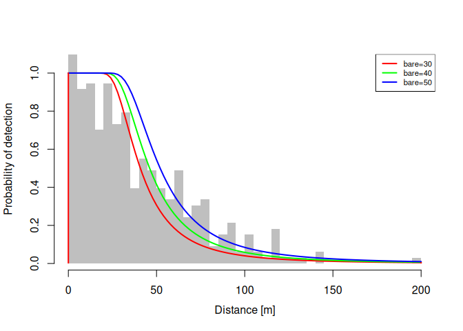

<!-- README.md is generated from README.Rmd. Please edit that file -->


<!-- badges: start -->

[](http://www.r-pkg.org/pkg/Rdistance)
[](http://cran.rstudio.com/web/packages/Rdistance/index.html)
[](https://travis-ci.org/tmcd82070/Rdistance)
[](http://www.r-pkg.org/pkg/Rdistance)
[](https://codecov.io/gh/tmcd82070/Rdistance)
<!-- badges: end -->

# Simplified Distance-Sampling Analysis in R

The **Rdistance** package contains routines for distance-sampling
analyses. Distance-sampling is a popular method for estimating density
and abundance of organisms in ecology. Abundance studies in ecology
often count target organisms along sampling routes (transects) or at a
series of fixed observation stations. Typically, the chances of
observing organisms declines as distance from the observer increases.
Objects far away are typically harder to see than objects nearby .

Distance-sampling studies are designed to correct for this decline in
detection probabilities associated with distance. The key feature of
distance-sampling studies is that observers on transects or at fixed
points measure the distance between themselves and the objects they
count. Assuming all objects at the observer’s location are counted and
that objects are randomly located in space, distance-sampling analyses
estimate the decline in probability of detection as distance from the
observer increases. As detection probabilities decline, observers miss
as many objects as they observe and this “break even” distance is called
the *effective sampling distance*. Unbiased estimates of density divide
the number of organisms seen by the effective area sampled which is
calculated using the effective sampling distance.


## General Features of **`Rdistance`**

**Rdistance** contains a set of functions to conduct distance-sampling
analyses from data collected on point or line transects. The primary
routines fit models (likelihood functions) to observed distances. Other
routines use the fitted likelihoods to estimate effective sampling
distances and probability of detection. From probability of detection,
density and abundance in the study area is estimated without observation
bias.

The likelihoods, or distance models, in **Rdistance** are specified
using regression-like formula (similar to `lm`, `glm`, etc.).
Likelihoods can be functions of detection or transect-level covariates.
Abundance routines accept fitted likelihood objects and perform
automated bootstrapping to estimate confidence intervals. Overall (study
area) and site-level (transect or point) abundance estimates are
available. A large suite of classical, parametric detection functions
are included along with some uncommon parametric functions (e.g., Gamma,
negative exponential) and non-parametric smoothed distance functions.
Custom (user-defined) detection functions are easily implemented (see
vignette). The help files and vignettes have been vetted by multiple
authors and tested in workshop settings. Plot methods for distance
function objects are included.

**Rdistance Resources:** The best place to learn about `Rdistance` is at
a workshop, processing a vignette, or the package’s [GitHub
Wiki](https://github.com/tmcd82070/Rdistance/wiki).


<!--  -->

## Installation

You can install the development version of Rdistance from
[GitHub](https://github.com/) with:

**Stable version:**

``` r
install.packages("Rdistance")
```

**Development version:** Directly from GitHub using the `devtools`
package:

``` r
if( !require("devtools") ){
  install.packages("devtools")
}
devtools::install_github("tmcd82070/Rdistance")
```


## Examples

These examples show the basic workflow of a distance-sampling analysis
in `Rdistance`:

### Line Transects - No Covariates

``` r
library(Rdistance)
#> Rdistance (version 2.2.0)

# Example data
data("sparrowDetectionData")
data("sparrowSiteData")
head(sparrowDetectionData)
#>   siteID groupsize sightdist sightangle     dist
#> 1     A1         1        65         15 16.8 [m]
#> 2     A1         1        70         10 12.2 [m]
#> 3     A1         1        25         75 24.1 [m]
#> 4     A1         1        40          5  3.5 [m]
#> 5     A1         1        70         85 69.7 [m]
#> 6     A1         1        10         90 10.0 [m]
head(sparrowSiteData)
#>   siteID  length observer bare herb shrub height shrubclass
#> 1     A1 500 [m]     obs4 36.7 15.9  20.1   26.4       High
#> 2     A2 500 [m]     obs4 38.7 16.1  19.3   25.0       High
#> 3     A3 500 [m]     obs5 37.7 18.8  19.8   27.0       High
#> 4     A4 500 [m]     obs5 37.7 17.9  19.9   27.1       High
#> 5     B1 500 [m]     obs3 58.5 17.6   5.2   19.6        Low
#> 6     B2 500 [m]     obs3 56.6 18.1   5.2   19.0        Low
```

``` r
dfuncFit <- dfuncEstim(dist ~ 1
                   , detectionData = sparrowDetectionData
                   , likelihood = "hazrate")
dfuncFit <- abundEstim(dfuncFit
         , detectionData = sparrowDetectionData
         , siteData = sparrowSiteData
         , area = units::set_units(2500, "hectares"), ci=NULL)
print(dfuncFit)
#> Call: dfuncEstim(formula = dist ~ 1, detectionData =
#>    sparrowDetectionData, likelihood = "hazrate")
#> Coefficients:
#>        Estimate   SE         z          p(>|z|)     
#> Sigma  47.093869  4.6896446  10.042098  9.953452e-24
#> k       2.820973  0.3242217   8.700751  3.296944e-18
#> 
#> Convergence: Success
#> Function: HAZRATE  
#> Strip: 0 [m] to 207 [m] 
#> Effective strip width (ESW): 63.88011 [m] 
#> Probability of detection: 0.3085995 
#> Scaling: g(0 [m]) = 1
#> Log likelihood: 1665.103 
#> AICc: 3334.241
#> 
#> Density in sampled area: 8.131553e-05 [1/m^2]
#> 
#> Abundance in 2.5e+07 [m^2] study area: 2032.888
plot(dfuncFit)
```


### Line Transects - With Vegetation Covariate

``` r
dfuncFit <- dfuncEstim(dist ~ bare
                   , detectionData = sparrowDetectionData
                   , siteData = sparrowSiteData
                   , likelihood = "hazrate")
dfuncFit <- abundEstim(dfuncFit
         , detectionData = sparrowDetectionData
         , siteData = sparrowSiteData
         , area = units::set_units(2500, "hectares"), ci=NULL)
print(dfuncFit)
#> Call: dfuncEstim(formula = dist ~ bare, detectionData =
#>    sparrowDetectionData, siteData = sparrowSiteData, likelihood =
#>    "hazrate")
#> Coefficients:
#>              Estimate    SE           z          p(>|z|)     
#> (Intercept)  3.17045651  0.231511298  13.694608  1.093486e-42
#> bare         0.01270951  0.003592534   3.537756  4.035434e-04
#> k            2.99762083  0.356404409   8.410729  4.074708e-17
#> 
#> Convergence: Success
#> Function: HAZRATE  
#> Strip: 0 [m] to 207 [m] 
#> Average effective strip width (ESW): 65.86774 [m] 
#> Average probability of detection: 0.3182017 
#> Scaling: g(0 [m]) = 1
#> Log likelihood: 1659.073 
#> AICc: 3324.214
#> 
#> Density in sampled area: 8.135213e-05 [1/m^2]
#> 
#> Abundance in 2.5e+07 [m^2] study area: 2033.803
plot(dfuncFit, newdata = data.frame(bare = c(30, 40, 50)), lty = 1)
```



### Point Transects - No Covariates

``` r
# Example data
data("thrasherDetectionData")
data("thrasherSiteData")
head(thrasherDetectionData)
#>   siteID groupsize    dist
#> 1  C1X01         1  11 [m]
#> 2  C1X01         1 183 [m]
#> 3  C1X02         1  58 [m]
#> 4  C1X04         1  89 [m]
#> 5  C1X05         1  83 [m]
#> 6  C1X06         1  95 [m]
head(thrasherSiteData)
#>   siteID observer bare herb shrub height
#> 1  C1X01     obs5 45.8 19.5  18.7   23.7
#> 2  C1X02     obs5 43.4 20.2  20.0   23.6
#> 3  C1X03     obs5 44.1 18.8  19.4   23.7
#> 4  C1X04     obs5 38.3 22.5  23.5   34.3
#> 5  C1X05     obs5 41.5 20.5  20.6   26.8
#> 6  C1X06     obs5 43.7 18.6  20.0   23.8
```

``` r
dfuncFit <- dfuncEstim(dist ~ 1
                   , detectionData = thrasherDetectionData
                   , likelihood = "hazrate"
                   , pointSurvey = TRUE)
dfuncFit <- abundEstim(dfuncFit
         , detectionData = thrasherDetectionData
         , siteData = thrasherSiteData
         , area = units::set_units(100, "acres"), ci=NULL)
print(dfuncFit)
#> Call: dfuncEstim(formula = dist ~ 1, detectionData =
#>    thrasherDetectionData, likelihood = "hazrate", pointSurvey = TRUE)
#> Coefficients:
#>        Estimate   SE        z         p(>|z|)     
#> Sigma  93.729366  5.872255  15.96139  2.373773e-57
#> k       4.199498  0.397140  10.57435  3.918838e-26
#> 
#> Convergence: Success
#> Function: HAZRATE  
#> Strip: 0 [m] to 265 [m] 
#> Effective detection radius (EDR): 118.6222 [m] 
#> Probability of detection: 0.2003733 
#> Scaling: g(0 [m]) = 1
#> Log likelihood: 999.0199 
#> AICc: 2002.103
#> 
#> Density in sampled area: 3.694821e-05 [1/m^2]
#> 
#> Abundance in 404687.3 [m^2] study area: 14.95247
plot(dfuncFit)
```


### Point Transects - With Vegetation Covariates

``` r
dfuncFit <- dfuncEstim(dist ~ bare + shrub
                   , detectionData = thrasherDetectionData
                   , siteData = thrasherSiteData
                   , likelihood = "hazrate"
                   , pointSurvey = TRUE)
dfuncFit <- abundEstim(dfuncFit
         , detectionData = thrasherDetectionData
         , siteData = thrasherSiteData
         , area = units::set_units(100, "acres"), ci=NULL)
print(dfuncFit)
#> Call: dfuncEstim(formula = dist ~ bare + shrub, detectionData =
#>    thrasherDetectionData, siteData = thrasherSiteData, likelihood =
#>    "hazrate", pointSurvey = TRUE)
#> Coefficients:
#>              Estimate      SE           z           p(>|z|)     
#> (Intercept)   6.255906155  0.653609024   9.5713277  1.055415e-21
#> bare         -0.002685066  0.008599183  -0.3122467  7.548531e-01
#> shrub        -0.076016772  0.021062194  -3.6091574  3.071932e-04
#> k             4.412910399  0.437284958  10.0916126  6.017275e-24
#> 
#> Convergence: Success
#> Function: HAZRATE  
#> Strip: 0 [m] to 265 [m] 
#> Average effective detection radius (EDR): 121.0046 [m] 
#> Average probability of detection: 0.2114999 
#> Scaling: g(0 [m]) = 1
#> Log likelihood: 994.7526 
#> AICc: 1997.718
#> 
#> Density in sampled area: 3.704634e-05 [1/m^2]
#> 
#> Abundance in 404687.3 [m^2] study area: 14.99218
plot(dfuncFit, newdata = data.frame(bare = c(30, 35, 40)
                                  , shrub = 20)
     , lty = 1)
```


<!-- github CI examples for auto rendering of Rmd <https://github.com/r-lib/actions/tree/v1/examples>. -->


# RECENT CHANGES

**Version 2.2.0: Major Update** (Fall 2022)

New features:

-   Measurement units on all distances are **required**
-   Allowed expansions and covariates in the same distance function
-   Renamed “uniform” likelihood to “logistic”. Uniform is deprecated.
-   Added covariates to Gamma likelihood estimation
-   Added color to printed output in RStudio
-   Reformatted output of abundance results
-   Updated starting values for faster estimation
-   Bug fixes:
    -   Fixed issue with contrasts in model.matrix
    -   Fixed issue with no observations during bootstrapping
    -   Fixed issues with changing scale locations (i.e., x.scl and
        g.x.sxl)
    -   Fixed ESW for w.lo \> 0
    -   Restricted likelihood values to be positive
-   Substantial documentation updates
-   Substantial testing facilities added.

**Version 2.1.3: Bug Fixes**

-   Fixed scaling error in the Gamma likelihood causing mode to be less
    than 1.0
-   Fixed inverted plots that occured when w.lo \> 0 (left-trunctation)
-   Fixed bug in `autoDistSamp` when `bySite=TRUE`
-   Fixed bug causing bootstrap failure of point transect surveys when
    `siteData` contained only one column

**Version 2.1.2: A Major Update**

New features included:

-   Point transect analysis (v1.3.2 only allowed line transects)
-   Covariates in the detection function (v1.3.2 did not allow
    covariates).  
-   Non-parametric (smoothed) distance functions
-   Enhanced plotting abilities
-   Enhanced vignettes
-   Many bug fixes


## Past Workshops

-   *Distance Sampling: Conventional and Hierarchical Methods for
    Abundance in R*
    -   Full-day workshop, 10/29/2017, The Society for Marine Mammalogy,
        Halifax, Nova Scotia
-   *Distance Sampling: Conventional and Hierarchical Methods for
    Abundance in R*
    -   Full-day workshop, 9/23/2017, The Wildlife Society, Albuquerque,
        NM


## Contact

Questions or interested in a future workshop? Contact the maintainer:
Trent McDonald (<trent@mcdonalddatasciences.com>)
